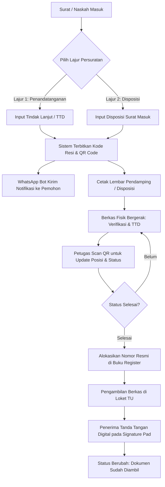

# 📘 MANUAL BOOK — PANDUAN PENGGUNAAN APLIKASI
# SITRACK (Sistem Informasi & Tracking Persuratan)
### Tata Usaha Sekretariat Jenderal — Kementerian Ketenagakerjaan Republik Indonesia
**Versi Sistem:** SiTrack v13 (Enterprise Edition) | **Dokumen:** Panduan Operasional Resmi

---

## 📑 Informasi Dokumen

| Parameter | Keterangan |
| :--- | :--- |
| **Nama Aplikasi** | **SiTrack** *(Sistem Informasi & Tracking Persuratan)* |
| **Instansi / Unit** | TU Sekretariat Jenderal — Kementerian Ketenagakerjaan Republik Indonesia |
| **Fokus Panduan** | Panduan operasional dua lajur persuratan, penomoran 16 jenis naskah dinas, barcode tracking, notifikasi WhatsApp otomatis, dan serah terima digital (*Digital Handover*) |
| **Sasaran Pengguna** | Super Admin, Admin Operator TU, Kasubbag TU Sekjen, Sekretaris Jenderal, dan Pemohon / Unit Kerja Pengolah |
| **Domain Resmi** | `https://sitrack.my.id` |

---

## 📋 Daftar Isi

1. [Gambaran Umum & Keunggulan Sistem](#1-gambaran-umum--keunggulan-sistem)
2. [Hak Akses & Peran Pengguna (User Roles)](#2-hak-akses--peran-pengguna-user-roles)
3. [Alur Kerja Utama Persuratan (End-to-End Workflow)](#3-alur-kerja-utama-persuratan-end-to-end-workflow)
4. [Akses & Keamanan Akun (Login & Profil)](#4-akses--keamanan-akun-login--profil)
5. [Dashboard Pusat Komando Persuratan](#5-dashboard-pusat-komando-persuratan)
6. [Portal Publik: Pelacakan & Pengajuan Mandiri](#6-portal-publik-pelacakan--pengajuan-mandiri)
7. [Integrasi Notifikasi WhatsApp Otomatis](#7-integrasi-notifikasi-whatsapp-otomatis)
8. [Manajemen Penomoran Surat (16 Jenis Naskah - Rekap 2026)](#8-manajemen-penomoran-surat-16-jenis-naskah---rekap-2026)
   - 8.1 [Ketersediaan Nomor (Tersedia, Pre-Order, Reservasi)](#81-ketersediaan-nomor-surat)
   - 8.2 [Buku Register Laporan Data Surat](#82-buku-register-laporan-data-surat)
9. [Lajur Pertama: Tindak Lanjut / Penandatanganan Pimpinan](#9-lajur-pertama-tindak-lanjut--penandatanganan-pimpinan)
10. [Lajur Kedua: Pengelolaan Disposisi Surat Masuk](#10-lajur-kedua-pengelolaan-disposisi-surat-masuk)
11. [Pemindai QR Code & Pembaruan Status Berkas](#11-pemindai-qr-code--pembaruan-status-berkas)
12. [Format Cetak Resmi & Tanda Tangan Digital Pengambilan](#12-format-cetak-resmi--tanda-tangan-digital-pengambilan)
13. [Pengelolaan Master Data (Khusus Super Admin)](#13-pengelolaan-master-data-khusus-super-admin)
14. [Panduan Pemecahan Masalah (Troubleshooting & FAQ)](#14-panduan-pemecahan-masalah-troubleshooting--faq)

---

## 1. Gambaran Umum & Keunggulan Sistem

**SiTrack** adalah aplikasi berbasis web modern yang dirancang khusus untuk memodernisasi, mempercepat, dan mengamankan tata kelola persuratan pada Bagian Tata Usaha Sekretariat Jenderal Kementerian Ketenagakerjaan RI.

### ✨ Fitur Unggulan SiTrack:
- **Dua Lajur Persuratan Terintegrasi:** Memisahkan secara tegas antara alur penandatanganan/paraf nota dinas dengan alur disposisi arahan pimpinan.
- **Standar 16 Jenis Naskah Dinas (Workbook Rekap 2026):** Format penomoran otomatis yang presisi sesuai kode klasifikasi arsip dan kode jabatan Kemnaker.
- **Pelacakan Berbasis QR Code:** Setiap naskah memiliki kode unik dan QR Code yang dapat dipindai secara instan menggunakan kamera smartphone/laptop.
- **Notifikasi WhatsApp Otomatis (Meta Cloud API):** Pemohon menerima konfirmasi resi pengajuan dan pembaruan posisi surat secara *real-time* ke nomor WhatsApp.
- **Serah Terima Berkas Digital (*Digital Handover*):** Dilengkapi *Signature Pad* digital pada lembar pendamping saat dokumen fisik diambil di loket TU.
- **Pencarian Mendalam (*Deep PDF Search*):** Mampu mencari dokumen berdasarkan metadata maupun teks di dalam file lampiran PDF.

---

## 2. Hak Akses & Peran Pengguna (User Roles)

Sistem membagi wewenang pengguna ke dalam 4 tingkatan peran (*Role-Based Access Control*):

| Peran (Role) | Hak Akses & Wewenang |
| :--- | :--- |
| 🛡️ **Super Administrator** | Akses penuh ke seluruh menu sistem, manajemen pengguna (*user*), master unit kerja, master kategori naskah, alur status, dan ekspor laporan master. |
| 👨‍💼 **Admin Operator TU** | Melakukan registrasi naskah baru, mengelola stok & registrasi penomoran surat, memproses disposisi, memperbarui status via QR, mencetak dokumen, dan melayani pengambilan berkas. |
| 📋 **Kasubbag TU Sekjen** | Memeriksa berkas masuk, melakukan verifikasi tata naskah, memantau pergerakan fisik dokumen, dan mengawasi lajur disposisi pimpinan. |
| 👔 **Sekretaris Jenderal** | Melihat ringkasan eksekutif persuratan masuk, memberikan lembar disposisi instruksi kepada unit kerja terkait/koordinator. |
| 🌐 **Pemohon / Publik** | Mengajukan permohonan naskah secara mandiri melalui portal publik, melacak posisi berkas, dan menerima update WhatsApp. |

---

## 3. Alur Kerja Utama Persuratan (End-to-End Workflow)

---

## 4. Akses & Keamanan Akun (Login & Profil)

### 4.1 Cara Masuk ke Aplikasi
1. Buka browser dan akses alamat resmi: **`https://sitrack.my.id/login`**.
2. Masukkan **Username** dan **Password** yang telah didaftarkan.
3. Klik tombol **Masuk ke Sistem**.
4. Jika kredensial valid, Anda akan langsung diarahkan ke Dashboard utama.

### 4.2 Mengubah Kata Sandi (Password)
1. Pada bagian pojok kiri bawah *sidebar*, klik nama/profil akun Anda.
2. Pilih menu **Ubah Password**.
3. Masukkan kata sandi lama, lalu masukkan kata sandi baru (minimal 8 karakter kombinasi huruf dan angka).
4. Klik **Simpan Perubahan**.

---

## 5. Dashboard Pusat Komando Persuratan

Dashboard dirancang sebagai pusat kendali untuk memantau seluruh aktivitas persuratan harian dalam satu layar.

### Komponen Utama Dashboard:
- **Kartu Metrik Utama:**
  - *Total Surat*: Keseluruhan dokumen yang tercatat dalam tahun berjalan.
  - *Lajur Tindak Lanjut / TTD*: Dokumen yang sedang dalam proses paraf atau tanda tangan.
  - *Lajur Disposisi*: Surat masuk yang memerlukan atau sedang dalam instruksi pimpinan.
  - *Nomor Tersedia*: Sisa kuota slot nomor surat yang siap digunakan.
- **Pintasan Cepat (*Quick Action*):** Tombol cepat untuk `+ Catat Naskah Baru` dan `+ Input Disposisi`.
- **Tabel Monitoring Surat Terbaru:** Menampilkan 10 transaksi persuratan terakhir lengkap dengan status dan posisinya.

---

## 6. Portal Publik: Pelacakan & Pengajuan Mandiri

SiTrack menyediakan antarmuka publik yang dapat diakses oleh seluruh pegawai atau unit kerja tanpa perlu login.

### 6.1 Melacak Status Surat
1. Buka menu **Portal Publik** atau akses `https://sitrack.my.id/tracking`.
2. Masukkan **Kode Tracking** (contoh: `ND_MEMO-20260921-001`) atau **Nomor Agenda**.
3. Klik tombol **Lacak Surat**.
4. Sistem menampilkan:
   - *Status & Posisi Terkini* berkas (misal: "Diperiksa Oleh Kasubbag TU Sekjen").
   - *Progress Bar* persentase tahapan administrasi.
   - *Timeline Riwayat*: Kronologi lengkap pergerakan surat beserta tanggal, jam, dan catatan petugas.

### 6.2 Pengajuan Permohonan Mandiri (`/ajukan-surat`)
Unit kerja pengolah dapat mendaftarkan konsep naskah secara mandiri:
1. Klik tombol **Ajukan Surat** pada navigasi atas portal publik.
2. Isi formulir pengajuan:
   - Jenis naskah yang dimohonkan.
   - Perihal surat dan unit kerja pengirim.
   - Nama pemohon dan **Nomor WhatsApp aktif** (wajib diisi untuk menerima notifikasi).
   - Unggah berkas dokumen (PDF/Word).
3. Klik **Kirim Pengajuan**. Sistem otomatis menerbitkan resi pelacakan.

---

## 7. Integrasi Notifikasi WhatsApp Otomatis

SiTrack terhubung langsung ke **WhatsApp Cloud Gateway**:

1. **Notifikasi Registrasi Sukses:** Begitu surat tercatat, pemohon langsung menerima pesan WhatsApp berisi nomor agenda, kode tracking, dan tautan langsung untuk memantau surat.
2. **Notifikasi Pembaruan Alur:** Setiap kali petugas melakukan scan QR atau memperbarui status naskah, sistem mengirimkan pesan status terbaru.
3. **Notifikasi Dokumen Siap Diambil:** Saat pimpinan telah menandatangani naskah, pemohon menerima pesan pemberitahuan untuk mengambil dokumen fisik di loket TU Sekjen.

---

## 8. Manajemen Penomoran Surat (16 Jenis Naskah - Rekap 2026)

### 8.1 Ketersediaan Nomor Surat
**Lokasi Menu:** *Sidebar → Penomoran Surat → Ketersediaan Nomor*

Menu ini berfungsi mengelola stok nomor urut naskah dinas per tahun anggaran untuk 16 jenis workbook (seperti *Nota Dinas, Undangan, SK, Surat Tugas, Edaran, dll.*).

#### 3 Model Alokasi Nomor:
1. **Tersedia (*Available*):** Membuat *batch* kuota nomor urut baru yang siap dipakai.
   - *Cara*: Klik `+ Tambah Nomor` ➔ Pilih Keperluan **Tersedia** ➔ Tentukan rentang nomor (contoh: 1 s/d 50) ➔ Klik **Simpan**.
2. **Pre-Order:** Mengalokasikan rentang nomor berurutan untuk unit tertentu sebelum naskah final selesai.
   - *Cara*: Klik `+ Tambah Nomor` ➔ Pilih **Pre-Order** ➔ Pilih rentang nomor dari stok yang tersedia ➔ Masukkan nama unit dan peruntukan ➔ Klik **Simpan**.
3. **Reservasi (*Booking*):** Mengunci satu nomor urut khusus untuk naskah tertentu.
   - *Cara*: Klik `+ Tambah Nomor` ➔ Pilih **Reservasi** ➔ Tentukan 1 nomor spesifik ➔ Masukkan nama PIC / keterangan reservasi ➔ Klik **Simpan**.

---

### 8.2 Buku Register Laporan Data Surat
**Lokasi Menu:** *Sidebar → Tindak Lanjut / TTD → Laporan Data Surat*

Menampilkan buku register penomoran resmi yang sudah terbit (*Used* / *Reserved*).

#### Tata Cara Registrasi Nomor Surat:
1. Klik tombol **`+ Tambah Data`** di kanan atas.
2. Lengkapi formulir registrasi:
   - **Jenis Naskah / Workbook**: Pilih salah satu dari 16 jenis naskah.
   - **Nomor Urut**: Pilih nomor urut dari stok nomor yang berstatus *Available* atau *Reserved*.
   - **Kode Klasifikasi Arsip**: Masukkan kode klasifikasi (contoh: `KP.08.01`, `HK.02`, `UM.01`).
   - **Unit Pengolah & Penandatangan**: Pilih unit pembuat dan pejabat penandatangan.
   - **Perihal & Tujuan**: Masukkan perihal surat dan pihak tujuan.
   - **Unggah Dokumen Final (PDF)**: Lampirkan file hasil scan naskah final yang sudah bertanda tangan.
3. Klik **Simpan**. Sistem secara otomatis mengunci nomor tersebut menjadi **Terpakai (`used`)** dan membentuk nomor surat lengkap:
   $$\text{Format: } \text{B-1/0908/HM.08/IX/2026}$$

#### Fitur Ekspor:
- Klik tombol **Cetak Laporan** ➔ Pilih **Export Excel (Multi-Sheet)** untuk mengunduh rekapitulasi seluruh 16 workbook dalam satu file Excel.

---

## 9. Lajur Pertama: Tindak Lanjut / Penandatanganan Pimpinan

**Lokasi Menu:** *Sidebar → Tindak Lanjut / TTD → Data Tindak Lanjut*

Khusus melayani alur naskah dinas internal yang memerlukan proses paraf Kasubbag TU, penelaahan, hingga penandatanganan Sekretaris Jenderal atau Menteri.

### Langkah Operasional:
1. **Penerimaan Berkas:** Klik `+ Catat Naskah Baru` saat berkas fisik masuk ke loket TU.
2. **Pengisian Metadata:** Isi unit pengirim, perihal, nama konseptor/pengantar, nomor HP, dan tindakan yang dimohonkan (Mohon Paraf / Mohon Tanda Tangan).
3. **Pemberian Resi:** Cetak Lembar Pendamping dan tempelkan pada map berkas.
4. **Pembaruan Tahapan Alur:**
   - `Diregistrasi` ➔ `Diperiksa Oleh TU Sekjen` ➔ `Diperiksa Oleh Kasubag TU Sekjen` ➔ `Diperiksa Oleh Sekjen` ➔ `Selesai dan Siap Untuk Diambil`.

---

## 10. Lajur Kedua: Pengelolaan Disposisi Surat Masuk

**Lokasi Menu:** *Sidebar → Lajur Disposisi*

Digunakan untuk menatausahakan surat masuk dari pihak eksternal/kementerian lain yang ditujukan kepada Sekretaris Jenderal.

### Langkah Operasional:
1. **Registrasi Surat Masuk:** Klik `+ Input Surat Disposisi` ➔ masukkan instansi asal, nomor surat masuk, perihal, dan tanggal surat.
2. **Pencatatan Instruksi Pimpinan:**
   - Buka menu **Lajur Disposisi** ➔ klik pada baris surat.
   - Pada panel lembar disposisi, pilih unit tujuan (dapat memilih lebih dari satu unit kerja).
   - Tentukan **Unit Koordinator Utama** dan unit pendamping.
   - Tuliskan instruksi pimpinan (contoh: *"Tindaklanjuti sesuai ketentuan"*, *"Hadiri/Wakili"*, *"Koordinasikan"*).
   - Tentukan batas waktu tindak lanjut (*Due Date*).
3. **Cetak Lembar Disposisi:** Klik tombol **Cetak Disposisi** untuk mencetak lembar disposisi format standar Kemnaker RI.

---

## 11. Pemindai QR Code & Pembaruan Status Berkas

**Lokasi Akses:** Tombol **Scan QR** di bilah atas (*topbar*) atau tombol **Update via QR**.

Fitur ini memungkinkan petugas memperbarui posisi dan status berkas dalam waktu kurang dari 5 detik tanpa perlu mengetik manual.

### 3 Pilihan Metode Pemindaian:
1. **Pemindai Kamera Langsung:** Arahkan kamera smartphone atau webcam laptop ke QR Code pada lembar pendamping naskah.
2. **Unggah Foto Berkas:** Jika menggunakan foto/dokumen digital, klik `Jepret / Upload Foto QR` dan pilih gambar dari galeri/folder.
3. **Input ID Pelacakan Manual:** Masukkan kode tracking pada kolom pencarian jika kamera tidak tersedia.

### Menyimpan Perubahan Status:
- Begitu QR Code terdeteksi, detail surat akan langsung terbuka.
- Pilih **Status Dokumen** baru dan **Posisi Berkas Saat Ini** (contoh: *Meja Kasubbag TU Sekjen*, *Loket Pengambilan*).
- Tambahkan catatan jika terdapat koreksi/revisi.
- Klik **Simpan Perubahan Status**.

---

## 12. Format Cetak Resmi & Tanda Tangan Digital Pengambilan

### 12.1 Lembar Pendamping Naskah Dinas
Dokumen kendali yang memuat:
- Kop Resmi Sub Bagian TU Sekjen, SAM, dan SKM.
- QR Code pelacakan dan kode resi surat.
- Kotak centang tindakan yang dimohonkan.
- Tabel riwayat alur paraf dan penomoran resmi.

### 12.2 Serah Terima Berkas Digital (*Digital Handover*)
Saat perwakilan unit pengolah mengambil berkas fisik yang sudah selesai di loket TU:
1. Petugas membuka menu surat terkait di loket TU.
2. Pada layar pengambilan, sistem menampilkan **Digital Signature Pad**.
3. Pengambil berkas membubuhkan tanda tangan digital langsung di layar monitor sentuh atau HP petugas.
4. Tanda tangan digital otomatis tersimpan permanen ke dalam sistem sebagai bukti otentik serah terima berkas.

---

## 13. Pengelolaan Master Data (Khusus Super Admin)

Super Administrator memiliki akses khusus untuk mengelola parameter sistem:

1. **Master Unit / Instansi:** Mengatur 24 unit kerja resmi di lingkungan Kemnaker RI (Biro, Ditjen, Badan, Pusat, Staf Ahli).
2. **Master Jenis Naskah Penomoran:** Mengatur pola nomor (*pattern*), format digit urut, dan buku register.
3. **Master Kategori Surat:** Mengelompokkan jenis persuratan dinas.
4. **Master Pengguna (*User Management*):** Menambah akun staf, menentukan *role* kewenangan, dan me-reset kata sandi.

---

## 14. Panduan Pemecahan Masalah (Troubleshooting & FAQ)

### ❓ Mengapa kamera scanner QR tidak terbuka di browser HP?
> **Solusi:** Browser modern (Chrome/Safari) mewajibkan koneksi **HTTPS** untuk memberikan izin kamera. Pastikan Anda mengakses alamat **`https://sitrack.my.id`** (dengan protokol HTTPS). Jika muncul pop-up izin browser, pilih **Allow / Izinkan Kamera**.

### ❓ Bagaimana jika WhatsApp notifikasi tidak terkirim?
> **Solusi:** 
> 1. Pastikan nomor handphone pemohon yang diinput aktif di WhatsApp.
> 2. Administrator dapat memverifikasi status token WhatsApp Meta melalui terminal server dengan perintah: `docker compose exec app php artisan wa:test 08xxxxxxxxxx`.

### ❓ Apakah nomor surat yang sudah dialokasikan bisa dibatalkan?
> **Solusi:**
> - Nomor berstatus **Pre-Order** atau **Reservasi** yang belum digunakan dapat dibatalkan melalui menu *Ketersediaan Nomor* (status kembali menjadi *Available*).
> - Nomor yang sudah tersimpan di *Laporan Data Surat* (berstatus *Used*) bersifat final dan tidak dapat dihapus untuk menjaga keutuhan audit nomor arsip negara.

### ❓ Mengapa surat yang baru dicatat di Tindak Lanjut belum muncul di Laporan Data Surat?
> **Solusi:** Surat di Tindak Lanjut yang berstatus `No: (Belum ada nomor)` adalah konsep naskah yang sedang dalam proses paraf/tanda tangan. Surat akan otomatis masuk ke buku register *Laporan Data Surat* begitu nomor resmi dialokasikan/diterbitkan.

---

**SiTrack — Sistem Informasi & Tracking Persuratan**  
*Bagian Tata Usaha Sekretariat Jenderal Kementerian Ketenagakerjaan Republik Indonesia © 2026*
