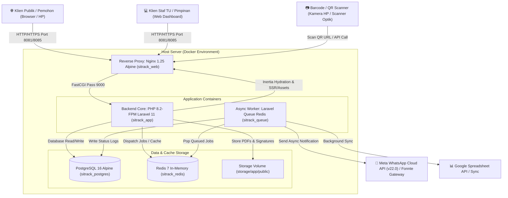
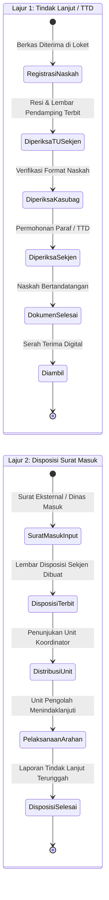
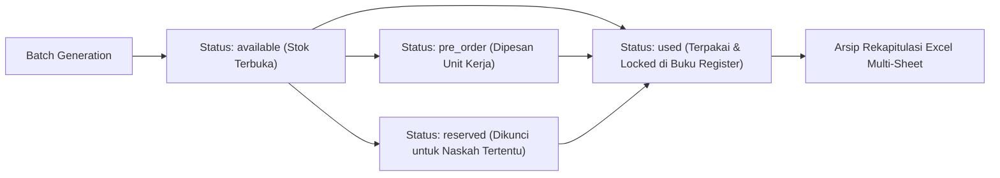
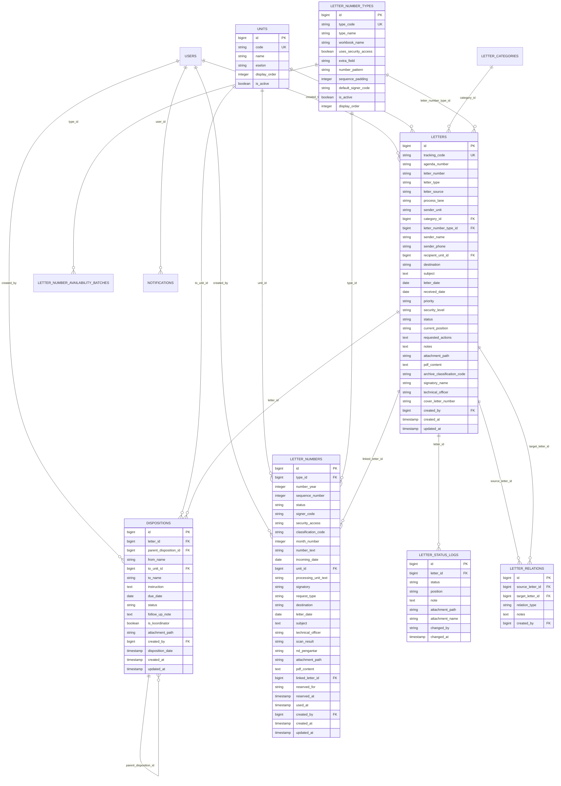
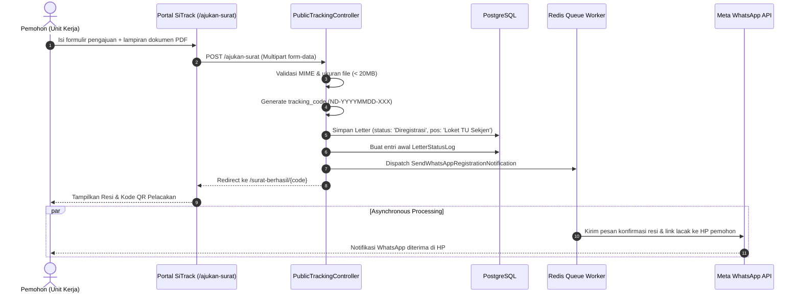
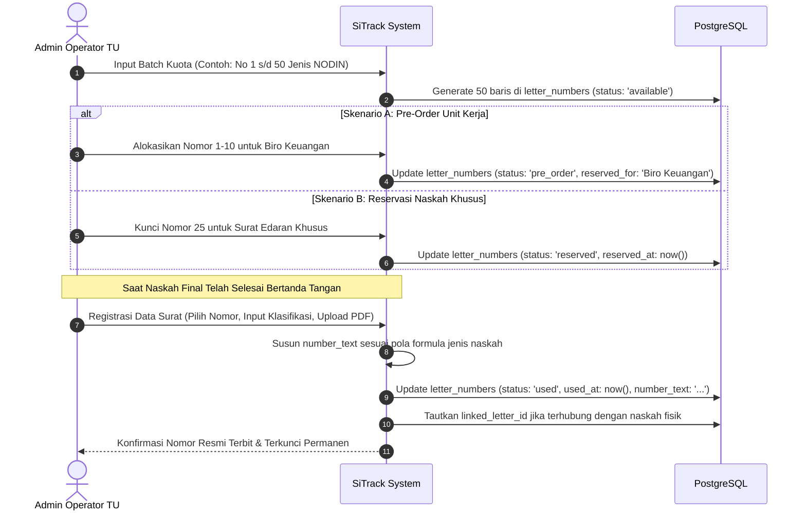
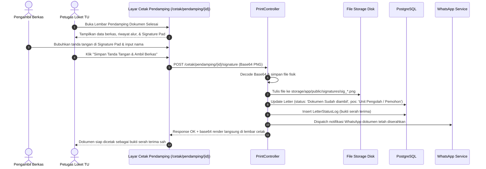
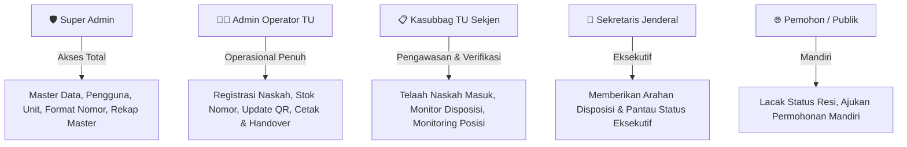

# 🏛️ SiTrack — Software Architecture & Technical Design Document (design.md)
### Sistem Informasi Tracking & Penatausahaan Naskah Dinas TU Sekjen Kemnaker RI
**Versi Dokumen:** 1.0.0 | **Sistem:** SiTrack v13 (Enterprise Edition) | **Status:** Approved Architecture

---

## 📌 Metadata Dokumen

| Parameter | Spesifikasi |
| :--- | :--- |
| **Nama Aplikasi** | **SiTrack** *(Sistem Informasi & Tracking Persuratan)* |
| **Instansi Pemilik** | Sub Bagian Tata Usaha Sekretariat Jenderal, Staf Ahli Menteri, dan Staf Khusus Menteri — Kementerian Ketenagakerjaan Republik Indonesia |
| **Platform / Arsitektur** | Web Application Monolith (Laravel 11 + Inertia.js v1/v2 + Vue 3 Composition API + PostgreSQL 16) |
| **Domain Resmi** | `https://sitrack.my.id` (IP Server Produksi: `http://192.168.223.103:8081`) |
| **Penulis & Arsitek** | Tim Pengembang Sistem Informasi TU Sekjen Kemnaker RI |
| **Target Pembaca** | Software Engineers, DevOps Engineers, System Architects, QA Engineers, dan Staf Teknis TU Sekjen |

---

## 📑 Daftar Isi

1. [Ringkasan Eksekutif & Filosofi Desain](#1-ringkasan-eksekutif--filosofi-desain)
2. [Arsitektur Sistem Tingkat Tinggi (High-Level Architecture)](#2-arsitektur-sistem-tingkat-tinggi-high-level-architecture)
   - 2.1 [Topologi Kontainer Docker](#21-topologi-kontainer-docker)
   - 2.2 [Pola Monolitik Modern (The Modern Monolith)](#22-pola-monolitik-modern-the-modern-monolith)
3. [Arsitektur Domain Bisnis (Core Business Domain)](#3-arsitektur-domain-bisnis-core-business-domain)
   - 3.1 [Model Alur Kerja 2 Lajur (Dual-Lane Architecture)](#31-model-alur-kerja-2-lajur-dual-lane-architecture)
   - 3.2 [Grafik Relasi Lintas Lajur (Cross-Lane Relational Graph)](#32-grafik-relasi-lintas-lajur-cross-lane-relational-graph)
   - 3.3 [Mesin Penomoran Otomatis 16 Naskah Dinas (Standar Rekap 2026)](#33-mesin-penomoran-otomatis-16-naskah-dinas-standar-rekap-2026)
   - 3.4 [Mesin Pelacakan & QR Code Scanner Cepat](#34-mesin-pelacakan--qr-code-scanner-cepat)
   - 3.5 [Serah Terima Digital (Digital Handover with Signature Pad)](#35-serah-terima-digital-digital-handover-with-signature-pad)
   - 3.6 [Pencarian Dokumen Mendalam (Deep PDF Search Engine)](#36-pencarian-dokumen-mendalam-deep-pdf-search-engine)
   - 3.7 [Mesin Notifikasi Omnichannel (WhatsApp Cloud API & In-App)](#37-mesin-notifikasi-omnichannel-whatsapp-cloud-api--in-app)
4. [Sistem Desain UI/UX & Estetika Visual](#4-sistem-desain-uiux--estetika-visual)
   - 4.1 [Palet Warna Resmi & Tipografi](#41-palet-warna-resmi--tipografi)
   - 4.2 [Prinsip Visual (Glassmorphism & Micro-Interactions)](#42-prinsip-visual-glassmorphism--micro-interactions)
   - 4.3 [Komponen Hero 3D Prosedural WebGL (Three.js)](#43-komponen-hero-3d-prosedural-webgl-threejs)
5. [Desain Basis Data & Skema ERD (Database Architecture)](#5-desain-basis-data--skema-erd-database-architecture)
   - 5.1 [Diagram Relasi Entitas (Entity-Relationship Diagram)](#51-diagram-relasi-entitas-entity-relationship-diagram)
   - 5.2 [Kamus Data Entitas Utama](#52-kamus-data-entitas-utama)
   - 5.3 [Strategi Indeksasi & Performa Query](#53-strategi-indeksasi--performa-query)
6. [Spesifikasi Komponen & Modul Aplikasi](#6-spesifikasi-komponen--modul-aplikasi)
   - 6.1 [Peta Rute & Modul Controller](#61-peta-rute--modul-controller)
   - 6.2 [Struktur Frontend Vue 3 (Pages & Components)](#62-struktur-frontend-vue-3-pages--components)
7. [Diagram Alur & Sekuens Logika (Sequence Diagrams)](#7-diagram-alur--sekuens-logika-sequence-diagrams)
   - 7.1 [Alur Pengajuan Mandiri & Pelacakan Berkas](#71-alur-pengajuan-mandiri--pelacakan-berkas)
   - 7.2 [Alur Siklus Penomoran Surat](#72-alur-siklus-penomoran-surat)
   - 7.3 [Alur Serah Terima Dokumen & Digital Signature](#73-alur-serah-terima-dokumen--digital-signature)
8. [Arsitektur Keamanan & Hak Akses (Security & RBAC)](#8-arsitektur-keamanan--hak-akses-security--rbac)
   - 8.1 [Role-Based Access Control (RBAC)](#81-role-based-access-control-rbac)
   - 8.2 [Sanitasi Input, Validasi MIME, & Proteksi Eksploitasi](#82-sanitasi-input-validasi-mime--proteksi-eksploitasi)
   - 8.3 [Audit Trail & Integritas Transaksi](#83-audit-trail--integritas-transaksi)
9. [Infrastruktur, Deployment, & Skalabilitas (DevOps)](#9-infrastruktur-deployment--skalabilitas-devops)

---

## 1. Ringkasan Eksekutif & Filosofi Desain

Tata kelola penatausahaan naskah dinas pada Sub Bagian Tata Usaha Sekretariat Jenderal Kementerian Ketenagakerjaan RI menghadapi tantangan volume dokumen yang tinggi, kebutuhan pemisahan alur yang ketat antara nota dinas tindak lanjut internal dan surat disposisi arahan pimpinan, serta kebutuhan validitas penomoran naskah yang terdistribusi ke 24 unit kerja.

**SiTrack** dirancang dengan filosofi:
1. **Zero Confusion (Dual-Lane Segregation)**: Menghilangkan kerancuan antara naskah internal yang dimohonkan paraf/tanda tangan pimpinan (*Lajur 1*) dengan surat masuk pimpinan yang memerlukan lembar disposisi berjenjang (*Lajur 2*).
2. **Deterministic Numbering**: Menjamin tidak ada nomor ganda (*zero duplicate numbers*), mendukung pemesanan kuota (*pre-order*), penguncian nomor penting (*reservation*), dan registrasi baku 16 jenis format naskah dinas Kemnaker 2026.
3. **Instant Transparency**: Pelacakan posisi fisik berkas (*real-time physical tracking*) dengan pemindaian barcode/QR kamera ponsel pintar, notifikasi otomatis WhatsApp pada setiap pembaruan alur, serta pencatatan bukti tanda tangan digital serah terima di loket TU.
4. **Rich & Modern Aesthetics**: Menghadirkan antarmuka elegan kelas *enterprise* dengan elemen Glassmorphism, animasi interaktif mikro, dan aset 3D procedural hemat daya yang memperkuat citra modern instansi pemerintah.

---

## 2. Arsitektur Sistem Tingkat Tinggi (High-Level Architecture)

SiTrack mengadopsi pola **Modern Monolith** yang menyatukan performa backend tangguh Laravel 11 dengan reaktivitas Single Page Application (SPA) Vue 3 melalui jembatan protokol **Inertia.js**. Seluruh subsistem berjalan di atas kontainerisasi Docker terisolasi.



### 2.1 Topologi Kontainer Docker

| Kontainer | Image Dasar | Port Mapping | Peran & Tanggung Jawab |
| :--- | :--- | :--- | :--- |
| `sitrack_web` | `nginx:alpine` kustom | `8081:80`, `8085:80` | Web server statis, reverse proxy FastCGI ke PHP-FPM, kompresi Gzip/Brotli, dan pembatasan laju request (*rate-limiting*). |
| `sitrack_app` | `php:8.2-fpm-alpine` | Internal (Port 9000) | Menjalankan *core application* Laravel 11, Eloquent ORM, Inertia response builder, generator PDF & SVG QR Code. |
| `sitrack_queue` | `php:8.2-fpm-alpine` | Internal | Worker asynchronous (`php artisan queue:work redis --sleep=2 --tries=3 --timeout=90`) untuk notifikasi WhatsApp, sync Google Spreadsheet, dan ekstraksi teks PDF. |
| `sitrack_postgres` | `postgres:16-alpine` | Internal (Port 5432) | Database relasional persuratan utama dengan encoding UTF-8, ekstensi indexing teks, dan integritas referensial kuat. |
| `sitrack_redis` | `redis:7-alpine` | Internal (Port 6379) | Cache aplikasi, penyimpanan session pengguna, dan queue broker performa tinggi dengan persistensi AOF (*Append-Only File*). |

### 2.2 Pola Monolitik Modern (The Modern Monolith)
- **Inertia.js Protocol**: Mengeliminasi kebutuhan pengelolaan endpoint REST API terpisah dan manajemen token manual pada antarmuka admin. State dikirim langsung dari controller Laravel sebagai *props* Vue 3 tanpa reload halaman penuh (*zero page reload*).
- **Hybrid CSS Framework**: Memanfaatkan kecepatan **Tailwind CSS v4** untuk utility layout mikro dan **Bootstrap 5.3** untuk struktur grid responsif formulir kedinasan.
- **Client-Side Routing via Ziggy**: Integrasi helper `route('name')` dari Laravel ke dalam template Vue 3 untuk menjaga konsistensi penamaan endpoint di seluruh aplikasi.

---

## 3. Arsitektur Domain Bisnis (Core Business Domain)

Sistem Informasi SiTrack dibangun di atas 7 domain kemampuan inti:

### 3.1 Model Alur Kerja 2 Lajur (Dual-Lane Architecture)

Untuk mencegah tercampurnya dokumen yang berbeda karakteristik administrasinya, sistem membagi transaksi persuratan ke dalam 2 lajur proses:



1. **Lajur 1 (Tindak Lanjut / Penandatanganan Pimpinan)**:
   - **Karakteristik**: Dokumen internal (Nota Dinas, Undangan, Surat Tugas, Keputusan) yang memerlukan tanda tangan Sekretaris Jenderal atau Menteri.
   - **Keluaran**: Lembar Pendamping Naskah Dinas ukuran A5 dengan QR pelacakan dan alokasi nomor resmi di buku register.
2. **Lajur 2 (Disposisi Surat Masuk)**:
   - **Karakteristik**: Surat masuk dari kementerian/lembaga lain atau unit internal yang ditujukan kepada Sekjen dan memerlukan arahan instruksional berjenjang.
   - **Keluaran**: Lembar Disposisi resmi format Kementerian Ketenagakerjaan dengan penetapan **Unit Koordinator Utama** dan unit pendamping.

### 3.2 Grafik Relasi Lintas Lajur (Cross-Lane Relational Graph)
Satu surat masuk pada Lajur Disposisi dapat menghasilkan beberapa naskah dinas keluar pada Lajur Tindak Lanjut (misalnya surat undangan seminar menghasilkan Nota Dinas penugasan dan Surat Tugas).
- Entitas `LetterRelation` memetakan relasi `source_letter_id` $\leftrightarrow$ `target_letter_id` dengan tipe relasi:
  - `disposition_to_followup` (Disposisi menghasilkan Nota Tindak Lanjut)
  - `reply_to` (Surat balasan atas surat masuk)
  - `parent_child` (Dokumen induk dan lampiran turunan)
  - `reference` (Dokumen rujukan administrasi)

### 3.3 Mesin Penomoran Otomatis 16 Naskah Dinas (Standar Rekap 2026)

SiTrack mengelola 16 buku register penomoran resmi (*workbook*) dengan pola formula otomatis yang mematuhi Tata Naskah Dinas Kemnaker:

$$\text{Pola: } [\text{Access Code}]-[\text{Sequence Number}]/[\text{Signer Code}]/[\text{Classification Code}]/[\text{Month Roman}]/[\text{Year}]$$

Contoh Nomor Terbit: `B-1/0908/HM.08/IX/2026`

#### 16 Jenis Naskah Dinas yang Didukung:
1. `NODIN` — Nota Dinas
2. `UNDANGAN` — Undangan Resmi
3. `KEPUTUSAN` — Surat Keputusan (SK)
4. `SURAT_TUGAS` — Surat Perintah Tugas (SPT)
5. `EDARAN` — Surat Edaran (SE)
6. `INSTRUKSI` — Instruksi Pimpinan
7. `PENGUMUMAN` — Pengumuman Kedinasan
8. `SURAT_BIASA` — Surat Dinas Biasa
9. `SURAT_KETERANGAN` — Surat Keterangan
10. `SURAT_KUASA` — Surat Kuasa
11. `BERITA_ACARA` — Berita Acara (BA)
12. `SURAT_PERJANJIAN` — Perjanjian Kerja Sama
13. `SURAT_PENGANTAR` — Surat Pengantar Naskah
14. `LEMBAR_DISPOSISI` — Format Khusus Disposisi
15. `TELAAHAN_STAF` — Telaahan Staf Teknis
16. `SERTIFIKAT_PIAGAM` — Sertifikat dan Piagam Penghargaan

#### Siklus Status Alokasi Nomor:


- **Sinkronisasi Dua Arah Google Spreadsheet**: Menyediakan endpoint `/ketersediaan-nomor/sync-spreadsheet` untuk memastikan ketersediaan nomor di sistem sinkron dengan pencatatan manual berbasis spreadsheet.

### 3.4 Mesin Pelacakan & QR Code Scanner Cepat
- **Format Resi**: `ND-YYYYMMDD-XXX` atau Nomor Agenda unik.
- **Generator QR Code**: Menghasilkan barcode SVG lokal murni (*server-side vector generation*) menggunakan `simplesoftwareio/simple-qrcode`, kemudian di-encode ke data URI base64. Hal ini menghilangkan dependensi library C eksternal (seperti Imagick) dan mematuhi aturan ketat *Content Security Policy* (`img-src 'self' data:`).
- **Scanner Mobile**: Menggunakan library Javascript `html5-qrcode` yang mengakses kamera smartphone/laptop secara instan dengan resolusi deteksi tinggi (10fps).

### 3.5 Serah Terima Digital (Digital Handover with Signature Pad)
Dokumen yang telah selesai ditandatangani oleh pimpinan dan siap diambil di loket TU Sekjen mewajibkan validasi serah terima fisik:
1. Layar cetak `/cetak/pendamping/{id}` dilengkapi kanvas **Digital Signature Pad**.
2. Pengambil berkas membubuhkan tanda tangan langsung di layar monitor sentuh atau ponsel petugas loket.
3. Tanda tangan dikonversi ke format PNG base64, diunggah via endpoint `POST /cetak/pendamping/{id}/signature`, disimpan ke `storage/app/public/signatures/`, dan otomatis memperbarui status surat menjadi `Dokumen Sudah diambil` serta menggeser posisi fisik ke `Unit Pengolah / Pemohon`.
4. Sistem memicu notifikasi WhatsApp serah terima berhasil ke nomor pemohon secara otomatis.

### 3.6 Pencarian Dokumen Mendalam (Deep PDF Search Engine)
Saat berkas lampiran PDF diunggah ke sistem (`Letter` atau `LetterNumber`), worker mengeksekusi ekstraksi teks menggunakan `smalot/pdfparser`.
- Teks hasil ekstraksi disimpan ke kolom `pdf_content` (tipe `TEXT` di PostgreSQL).
- Pencarian data surat tidak hanya mencocokkan metadata (perihal, unit, nomor), tetapi juga melakukan *full-content search* ke dalam isi dokumen menggunakan query parameterized:
  ```sql
  WHERE letters.subject ILIKE ? OR letters.pdf_content ILIKE ?
  ```

### 3.7 Mesin Notifikasi Omnichannel (WhatsApp Cloud API & In-App)
- **WhatsApp Gateway**: Terhubung langsung ke **Meta WhatsApp Cloud API (Graph API v22.0)** menggunakan template pesan dinamis:
  - Notifikasi Resi Pengajuan Baru
  - Notifikasi Pembaruan Alur / Status Surat
  - Notifikasi Dokumen Siap Diambil di Loket
  - Notifikasi Serah Terima Dokumen (Disertai nama pengambil)
- **Fonnte Fallback**: Mode peralihan alternatif jika Meta Cloud API mengalami kendala jaringan.
- **In-App Notification**: Tabel `notifications` mencatat log notifikasi staf internal lengkap dengan status dibaca (`is_read`) dan indikator badge lonceng di navbar.

---

## 4. Sistem Desain UI/UX & Estetika Visual

Antarmuka SiTrack dibangun dengan memprioritaskan estetika premium, kenyamanan pengguna (*usability*), dan keterbacaan data tinggi (*high data-density*).

### 4.1 Palet Warna Resmi & Tipografi

```
Primary Navy:       #2743AF  ██████████  (Sidebar, Brand CTA, Header Utama)
Primary Accent:     #3DA5F9  ██████████  (Active State, Badges, Glow Highlights)
Mid Azure Blue:     #4A9CF0  ██████████  (Hover States, Gradients, Secondary CTA)
Dark Slate:         #0F172A  ██████████  (Headings, Teks Primer)
Slate Muted:        #64748B  ██████████  (Teks Sekunder, Meta Info, Label)
Surface Light:      #F8FAFC  ██████████  (Background Kanvas Aplikasi)
Card White:         #FFFFFF  ██████████  (Kartu, Modal, Container)
Border Subtle:      #E2E8F0  ██████████  (Garis Batas Halus)
```

- **Tipografi**: Menggunakan font modern sans-serif **Inter** dan **Plus Jakarta Sans** dengan hirarki heading ketat (`h1` s/d `h4`) untuk menciptakan keteraturan visual.

### 4.2 Prinsip Visual (Glassmorphism & Micro-Interactions)
- **Glassmorphism**: Diterapkan pada bilah pencarian pelacakan hero (`backdrop-filter: blur(12px)` dengan `background: rgba(255, 255, 255, 0.85)` dan border tipis `rgba(255, 255, 255, 0.4)`).
- **Micro-Animations**: Transisi halus state tombol dan kartu menggunakan kurva kubik `cubic-bezier(0.4, 0, 0.2, 1)` dengan durasi 200ms–300ms.
- **Status Badges**: Indikator warna semantik:
  - *Selesai / Sudah Diambil*: Emerald Green (`#10B981`)
  - *Dalam Proses / Paraf*: Amber Orange (`#F59E0B`)
  - *Tersedia (Nomor)*: Sky Blue (`#3DA5F9`)
  - *Dibatalkan / Revisi*: Rose Red (`#EF4444`)

### 4.3 Komponen Hero 3D Prosedural WebGL (Three.js)
Pada halaman publik `/tracking`, terdapat komponen 3D interaktif `TrackingHero.vue`:
- **Model Prosedural**: Kotak surat kedinasan (*Mailbox*) dan amplop naskah yang dibangun secara matematika prosedural tanpa aset `.gltf` eksternal yang berat (bobot geometris < 800 vertex).
- **Efisiensi Energi (Power Saving)**: Menggunakan `IntersectionObserver`. Animasi rendering WebGL di-pause (0 FPS / 0% CPU) saat komponen keluar dari viewport pengguna, dan di-resume saat terlihat kembali.

---

## 5. Desain Basis Data & Skema ERD (Database Architecture)

### 5.1 Diagram Relasi Entitas (Entity-Relationship Diagram)



### 5.2 Kamus Data Entitas Utama

#### Tabel `letters` (Induk Transaksi Persuratan)
Menampung seluruh dokumen fisik/digital yang masuk ke loket TU Sekjen baik untuk alur tindak lanjut maupun disposisi.
- `tracking_code`: Kode resi pelacakan publik acak/terformat unik (contoh: `ND-20260921-001`).
- `process_lane`: Penentu lajur persuratan (`tindak_lanjut` atau `disposisi`).
- `status`: Tahapan proses terkini (`Diregistrasi`, `Diperiksa Oleh TU Sekjen`, `Diperiksa Oleh Kasubag TU Sekjen`, `Diperiksa Oleh Sekjen`, `Selesai dan Siap Untuk Diambil`, `Dokumen Sudah diambil`).
- `current_position`: Lokasi fisik berkas (`Loket TU Sekjen`, `Meja Kasubbag TU Sekjen`, `Ruang Sekjen`, `Unit Pengolah / Pemohon`).
- `attachment_path`: Lokasi file dokumen PDF utama atau gambar serah terima tanda tangan digital (`signatures/sig_...png`).
- `pdf_content`: Hasil ekstraksi teks OCR/parser untuk pencarian kata kunci mendalam.

#### Tabel `dispositions` (Instruksi Berjenjang)
Menyimpan riwayat instruksi Sekjen kepada unit eselon I/II:
- `is_koordinator`: Nilai boolean (`true`/`false`) yang menandai unit kerja pemegang tanggung jawab koordinasi utama jika surat ditujukan ke banyak unit kerja.
- `parent_disposition_id`: Mendukung disposisi turunan berjenjang (Disposisi Sekjen $\rightarrow$ Disposisi Direktur/Karo $\rightarrow$ Disposisi Kasubdit/Koordinator).

#### Tabel `letter_numbers` (Buku Register Nomor)
Menyimpan status hak pakai nomor urut pada 16 jenis workbook persuratan:
- `sequence_number`: Angka nomor urut asli (1, 2, 3, ...).
- `number_text`: Format nomor lengkap siap cetak (`B-1/0908/HM.08/IX/2026`).
- `status`: `available`, `pre_order`, `reserved`, `used`.

### 5.3 Strategi Indeksasi & Performa Query

Untuk memastikan query tetap responsif (< 100ms) saat database mencapai ratusan ribu dokumen:
1. **B-Tree Indexing**:
   - `letters(tracking_code)` — Lookup instan untuk portal pelacakan publik.
   - `letters(agenda_number)` — Pencarian nomor agenda cepat.
   - `letters(process_lane, status)` — Filter gabungan pada halaman index lajur.
   - `letter_numbers(type_id, number_year, status)` — Pencarian stok nomor naskah per tahun berjalan.
2. **Eager Loading Optimization**:
   Semua controller wajib menggunakan eager loading Eloquent (`with(['category', 'recipientUnit', 'dispositions.toUnit'])`) untuk mencegah anomali query *N+1*.

---

## 6. Spesifikasi Komponen & Modul Aplikasi

### 6.1 Peta Rute & Modul Controller

| Modul Controller | Base Route | Middleware | Fungsi Utama |
| :--- | :--- | :--- | :--- |
| `PublicTrackingController` | `/tracking`, `/ajukan-surat` | Public | Pencarian resi publik, pengajuan mandiri pemohon, dan streaming file lampiran aman. |
| `PrintController` | `/cetak/pendamping`, `/cetak/disposisi` | Public / Staff | Render lembar disposisi 1:1, render lembar pendamping, dan simpan tanda tangan digital. |
| `DashboardController` | `/dashboard` | `auth`, `perm:view dashboard` | Agregasi kartu metrik, statistik volume per lajur, dan monitoring aktivitas terbaru. |
| `SignatureLetterController` | `/tindak-lanjut` | `auth`, `perm:* signature lane` | Manajemen penuh alur naskah tindak lanjut, nota dinas, paraf, dan tanda tangan pimpinan. |
| `DispositionLetterController` | `/disposisi` | `auth`, `perm:* disposition lane` | Manajemen surat masuk pimpinan, input instruksi disposisi, dan penetapan koordinator unit. |
| `LetterAvailabilityController`| `/ketersediaan-nomor` | `auth`, `perm:* number availability` | Pembuatan kuota batch nomor, pre-order, reservasi, dan sinkronisasi Google Spreadsheet. |
| `DataSuratController` | `/data-surat` | `auth`, `perm:* letter data` | Buku register penerbitan nomor resmi, upload naskah final, dan ekspor Excel multi-sheet. |
| `ScanQrController` | `/scan-status` | `auth`, `perm:update status qr` | Pemindaian barcode kamera untuk update cepat posisi fisik berkas dan status alur. |
| `LetterRelationController` | `/letter-relations` | `auth`, `perm:manage letter relations`| Menghubungkan relasi lintas surat antara lajur disposisi dan lajur tindak lanjut. |
| `NotificationController` | `/notifications` | `auth` | Manajemen notifikasi internal staf dan status baca. |
| `Master Controllers` | `/master/*` | `auth`, `perm:manage *` | Pengelolaan data referensi: Unit kerja, kategori naskah, format jenis penomoran, dan pengguna. |

### 6.2 Struktur Frontend Vue 3 (Pages & Components)

```
resources/js/
├── Components/
│   ├── ApplicationLogo.vue        # Logo resmi Kemnaker RI & SiTrack
│   ├── SearchableSelect.vue       # Dropdown filter teleported dengan fitur pencarian teks
│   ├── ToastNotification.vue      # Alert floating otomatis session flash Laravel
│   ├── TrackingHero.vue           # 3D procedural WebGL canvas (Three.js mailbox)
│   └── TopNavigation.vue          # Navbar dengan counter notifikasi & profil
├── Layouts/
│   ├── AuthenticatedLayout.vue    # Layout dashboard staf lengkap dengan sidebar responsif
│   └── GuestLayout.vue            # Layout bersih untuk login dan portal publik
└── Pages/
    ├── Dashboard/                 # Dashboard komando utama
    ├── TindakLanjut/              # Lajur 1: List, Create, Edit, Detail
    ├── Disposisi/                 # Lajur 2: List, Form Disposisi, Hierarki Instruksi
    ├── KetersediaanNomor/         # Batch generation, kartu stok, modal pre-order
    ├── DataSurat/                 # Buku register naskah terbit & filter klasifikasi
    ├── Tracking/                  # Portal pelacakan publik, timeline, form pengajuan
    ├── Print/                     # Lembar Disposisi & Lembar Pendamping + Signature Pad
    ├── ScanQr/                    # Antarmuka kamera pemindai QR code
    └── Master/                    # Manajemen Unit, Pengguna, Jenis Nomor, Kategori
```

---

## 7. Diagram Alur & Sekuens Logika (Sequence Diagrams)

### 7.1 Alur Pengajuan Mandiri & Pelacakan Berkas



### 7.2 Alur Siklus Penomoran Surat



### 7.3 Alur Serah Terima Dokumen & Digital Signature



---

## 8. Arsitektur Keamanan & Hak Akses (Security & RBAC)

### 8.1 Role-Based Access Control (RBAC)
Sistem menggunakan paket **Spatie Laravel-Permission** dengan pemisahan 5 peran (*roles*):



### 8.2 Sanitasi Input, Validasi MIME, & Proteksi Eksploitasi
- **SQL Injection Prevention**: 100% interaksi database dilakukan melalui PDO parameterized query pada Eloquent ORM. Tidak ada raw query concatenations yang terekspos ke input pengguna.
- **Cross-Site Scripting (XSS)**: Seluruh output yang dirender melalui Vue 3 template di-escape secara otomatis. Data HTML dinamis dinetralkan sebelum masuk ke DOM.
- **CSRF Protection**: Seluruh request `POST`, `PUT`, `PATCH`, dan `DELETE` divalidasi oleh middleware `VerifyCsrfToken` Laravel menggunakan token sesi terenkripsi.
- **File Upload Hardening**:
  - Validasi ketat ekstensi dan tipe MIME: `mimes:pdf,docx,jpg,jpeg,png` dengan ukuran maksimum 20MB.
  - File disimpan dengan nama acak/timestamp pada folder terisolasi di luar root publik web server (`storage/app/public/...`).
  - Unduhan lampiran melalui streaming controller dengan verifikasi header `Content-Disposition: inline`.

### 8.3 Audit Trail & Integritas Transaksi
- **Transaksi Basis Data Atomik (`DB::transaction`)**: Seluruh operasi yang melibatkan mutasi lebih dari satu tabel (misal: pendaftaran surat + log status + relasi) dibungkus dalam blok transaksi database. Jika terjadi kegagalan sistem, seluruh mutasi di-*rollback* secara instan.
- **Riwayat Status Tidak Terhapus (Immutable Audit Trail)**: Tabel `letter_status_logs` mencatat setiap perubahan status, waktu perubahan (`changed_at`), petugas yang mengubah (`changed_by`), catatan koreksi, serta lampiran perubahan. Catatan ini bersifat *append-only* untuk kebutuhan audit administrasi negara.

---

## 9. Infrastruktur, Deployment, & Skalabilitas (DevOps)

### 9.1 Lingkungan Server Produksi

```
IP Server:        192.168.223.103
Port Publik:      8081 / 8085
OS Host:          Linux Ubuntu Server 22.04 LTS
Spesifikasi Min:  4 vCPU, 8 GB RAM, 100 GB SSD Storage
Docker Engine:    v24.0+ dengan Docker Compose v2.20+
```

### 9.2 Prosedur Deployment Standar

Untuk memperbarui aplikasi di server produksi tanpa *downtime* panjang:

```bash
# 1. Masuk ke direktori aplikasi
cd /opt/sitrack

# 2. Ambil perubahan terbaru dari git repository
git pull origin main

# 3. Jalankan migrasi basis data (jika ada skema baru)
docker compose exec app php artisan migrate --force

# 4. Bersihkan dan kompilasi ulang cache framework
docker compose exec app php artisan optimize:clear
docker compose exec app php artisan config:cache
docker compose exec app php artisan route:cache
docker compose exec app php artisan view:cache

# 5. Restart worker queue agar memuat kode terbaru
docker compose restart queue
```

### 9.3 Rencana Pemulihan Bencana (Disaster Recovery & Backup)
- **Backup Harian PostgreSQL**: Skrip cron otomatis mengeksekusi `pg_dump` ke media penyimpanan terpisah setiap pukul 02:00 WIB:
  ```bash
  docker compose exec -T postgres pg_dump -U postgres sitrack | gzip > /backup/sitrack_$(date +%Y%m%d).sql.gz
  ```
- **Retensi Berkas**: Berkas fisik di direktori `storage/app/public` disinkronkan secara inkremental menggunakan `rsync` ke server backup sekunder.

---

## 10. Kesimpulan & Status Kepatuhan

Desain teknis **SiTrack** ini memadukan standarisasi tata naskah dinas Kementerian Ketenagakerjaan Republik Indonesia dengan arsitektur rekayasa perangkat lunak modern. Pemisahan dua lajur persuratan, transparansi pelacakan berbasis QR Code, keamanan hak akses berjenjang, dan keandalan sistem penomoran otomatis menjamin penatausahaan persuratan di lingkungan TU Sekjen berjalan cepat, akuntabel, dan bebas dari anomali duplikasi data.

*Hak Cipta © 2026 Bagian Tata Usaha Sekretariat Jenderal Kementerian Ketenagakerjaan Republik Indonesia.*
